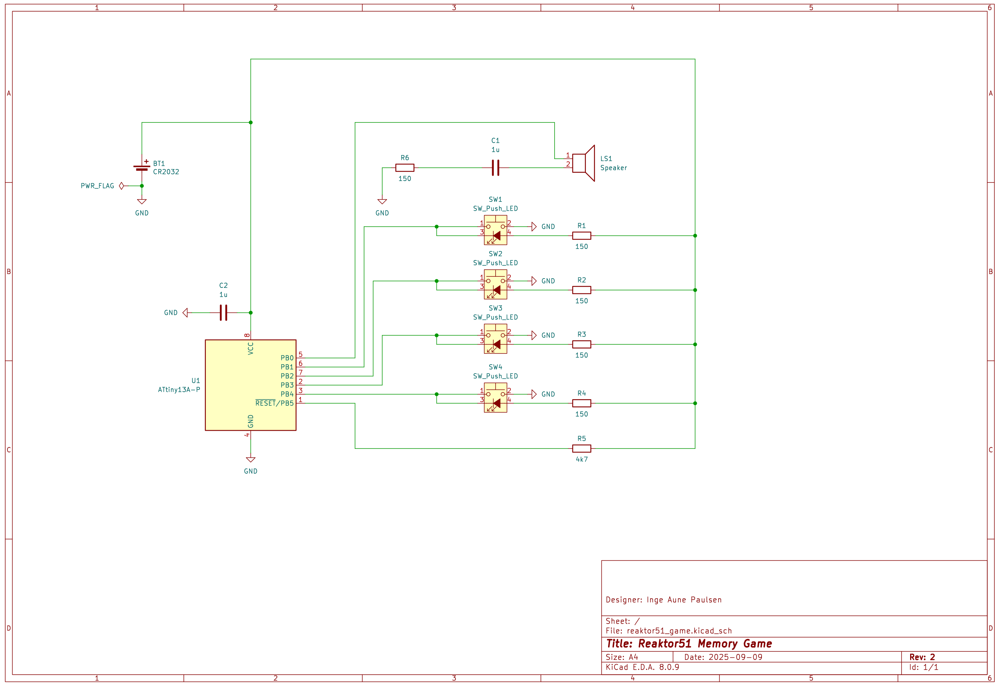
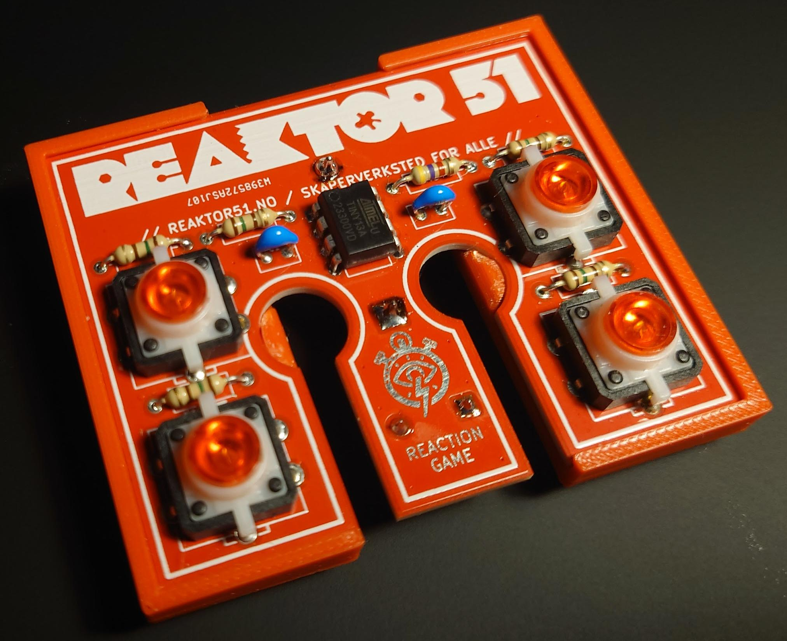

# Reaktor51 Memory Game

Her er kort #2 i "Reaktor51" serien! Litt flere komponenter å lodde opp, men alt er enkle hullmonterte komponenter. Dette er et minnespill, der målet er å huske møsteret som blir vist med lyd og lys. Knappene har innebygde LED's som blinker i en tilfeldig rekkefølge. Spilleren må herme dette mønsteret ved å trykke på knappene. Lyd og lys indikerer om spilleren har tapt eller vunnet!

Det er valgt å bruke knapper med røde LED's. Disse lyser sterkest av de fargene som var tilgjengelig for denne typen knapper.

## Kretskort

Gerber for bestilling av PCB:
[./rev2/reaktor51_game_pcb_rev2.zip](./rev2/reaktor51_game_pcb_rev2.zip)

 - Loddestopplakk: Rød
 - Silketrykk: Hvit
 - Tykkelse: 1.6mm
 - Overflate: HASL lead free

## Deleliste

| Komponent | Beskrivelse                              | Antall   | Verdi           | Link   |
|-|-|-|-|-|
| BT1       | Batteriholder for CR2032                 | 1        | Keystone 103    | https://www.digikey.no/en/products/detail/keystone-electronics/103/331620       | 
| U1        | AVR Microkontroller                      | 1        | ATtiny13A-PU    | https://www.digikey.no/en/products/detail/microchip-technology/ATTINY13A-PU/1914671       | 
| C1, C2    | Keramisk kondensator                     | 1        | 1uF 25V         | https://www.digikey.no/en/products/detail/tdk-corporation/FG18X7R1E105KRT00/7326658      |
| LS1       | Piezo høyttaler D=14mm H=4mm Pitch=7.5mm | 1        | 14x4mm 7.5mm    | https://www.aliexpress.com/item/1005004932492920.html    |
| R1, R2, R3, R4, R6  | Motstand 150ohm (2.3x6mm)      | 5        | 150ohm          | https://www.digikey.no/en/products/detail/stackpole-electronics-inc/CF14JT150R/1741294    |
| R5        | Motstand 4.7kohm (2.3x6mm)               | 1        | 4.7kohm         | https://www.digikey.no/en/products/detail/stackpole-electronics-inc/CF14JT4K70/1741428    |
| SW1, SW2, SW3, SW4  | Trykknapp med rød LED 12x12mm  | 4        | 12x12x7.3 RED   | https://www.aliexpress.com/item/1005003507477622.html    |

## Skjema

## Håndtak

Bruk denne filen for å 3d-printe et håndtak, som gjør kortet behagelig å holde i. Printes i normal og speilvendt utgave. Klipp komponentbeina korte på undersiden, slik at håndtakene blir enklere å skyve innpå.

[./rev2/reaktor51_game_handle.step](./rev2/reaktor51_game_handle.step)

