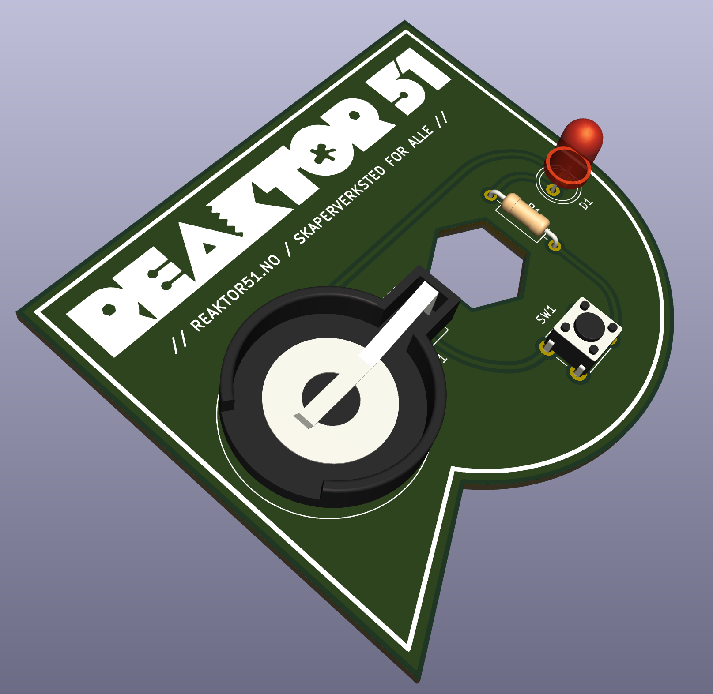
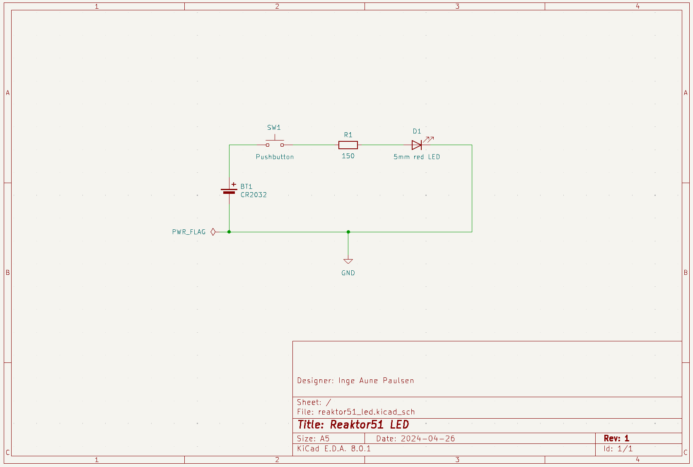

# Reaktor51 LED PCB

Her er et enkelt design som intro til KiCad. Kortet egner seg også som et øvingskort for lodding.

Gerber for bestilling av PCB:
[out/reaktor51_led_rev1-rc2.zip](out/reaktor51_led_rev1-rc2.zip)